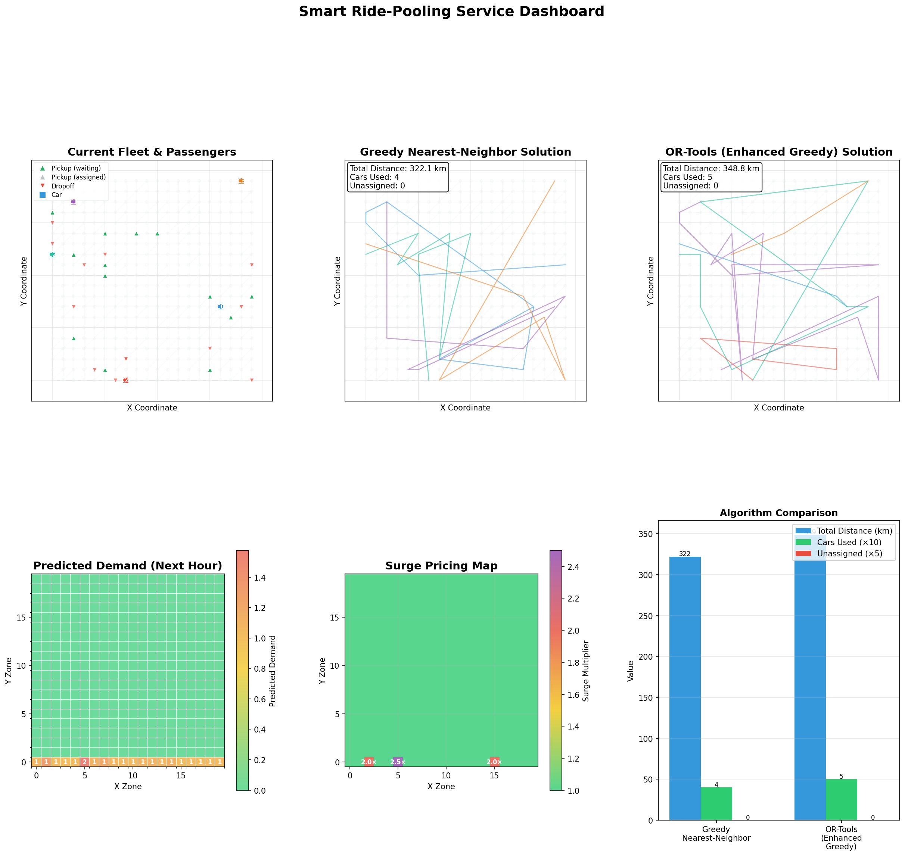

# Smart Ride-Pooling Service Simulation

<p align="center">
  
  <br>
  <em>Dashboard visualizing real-time fleet operations, demand heatmaps and pricing zones.</em>
</p>

A comprehensive decision science project simulating a ride-pooling service (like Uber/Lyft) with three core intelligence modules:
1.  **Vehicle Routing:** Comparing Greedy heuristics vs. Exact solvers (Google OR-Tools) with pickup & delivery constraints.
2.  **Dynamic Pricing:** Surge pricing algorithm based on supply/demand ratios and zone density.
3.  **Demand Prediction:** Machine learning (Random Forest) to forecast demand and recommend fleet repositioning.

##  Features

*   **Synthetic City Generation:** Creates grid-based cities with weighted edges and diagonal shortcuts.
*   **Realistic Simulation:** Generates historical data with rush hour patterns and demand hotspots.
*   **Interactive Dashboard:** Visualizes fleet, routes, demand heatmaps, and surge zones.
*   **Optimization:** Solves the VRP (Vehicle Routing Problem) balancing total distance vs. fleet utilization (Global Span Cost).

##  Installation

This project uses modern Python packaging.

### Prerequisites
*   Python 3.11+

### Setup
```bash
# 1. Clone the repository
git clone <repository_url>
cd ride-pooling-service

# 2. Sync (automatically creates venv AND uv.lock)
uv sync

# 3. Run (no need to activate)
uv run main.py
```

##  Usage

Run the simulation via the command line:

```bash
# Run with default settings (40x40 grid, 40 cars, 40 passengers)
uv run main.py

# Custom simulation
uv run main.py --grid-size 20 --num-cars 15 --num-passengers 25

# Save the dashboard instead of showing it
uv run main.py --save-dashboard results.png

# Run without visualization (headless mode)
uv run main.py --no-viz
```

### Command Line Arguments
*   `--num-cars`: Size of the fleet (default: 40)
*   `--num-passengers`: Number of active requests_ (default: 40)
*   `--grid-size`: Dimension of the city grid (default: 40)
*   `--seed`: Random seed for reproducibility (default: 42)
*   `--no-viz`: Disable pop-up window (useful for servers)
*   `--save-dashboard`: Path to save the output image

##  Testing

The project includes a full test suite using `pytest`.

```bash
# Run all tests
python -m pytest tests/

# Run specific test module
python -m pytest tests/test_routing.py
```

##  Solvers & Logic

### Routing
*   **Greedy:** Assigns the nearest available car to the oldest request. Fast but inefficient.
*   **OR-Tools:** Uses Constraint Programming to optimize total distance while satisfying Pickup & Delivery pairs. Includes `GlobalSpanCost` to ensure workload is distributed across the fleet.

### Pricing
Dynamic pricing activates when `active_requests / available_cars` > 1.0. 
*   **Surge Levels:** 1.25x (Moderate), 1.5x (High), 2.0x (Extreme).
*   **Zone Adjustment:** Prices increase further in high-density hotspots.

### Prediction
Changes demand based on:
*   Time of day (Hour sin/cos features)
*   Day of week
*   Historical hotspot data
*   **Output:** Recommends "Reposition Moves" for idle cars to move toward anticipated hot zones.
